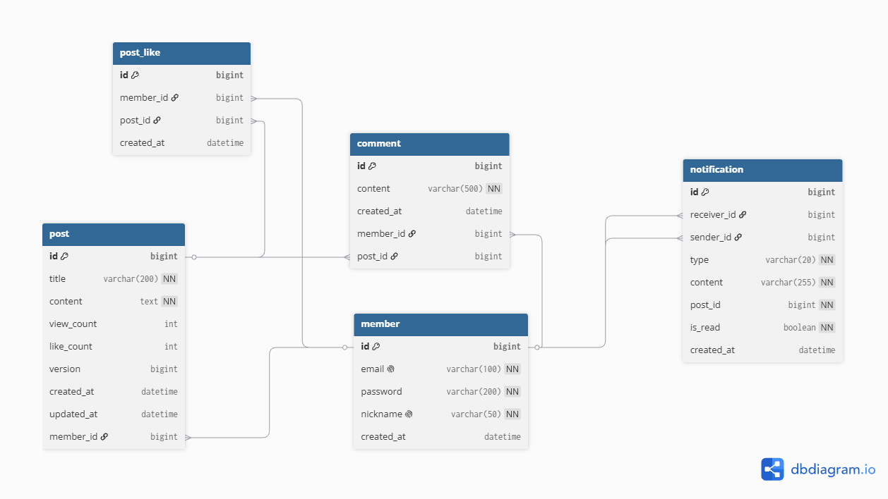

# 🌐 커뮤니티 게시판

Spring Boot + React로 구현한 풀스택 커뮤니티 게시판 프로젝트입니다.

## 💡 프로젝트 소개
Spring Boot와 React를 활용한 풀스택 개발 역량을 키우기 위해
커뮤니티 게시판을 직접 설계하고 구현했습니다.
단순 기능 구현을 넘어 레이어드 아키텍처, 디자인 패턴, 배포까지
실무와 유사한 개발 흐름으로 진행하는 것을 목표로 했습니다.

## 🔗 배포 URL

- **프론트엔드**: https://community-eight.vercel.app
- **백엔드**: https://community-production-e28e.up.railway.app

---

## 🛠 기술 스택

### Backend


### Frontend


### Infrastructure


## 🤔 기술 선택 이유

**JWT vs 세션**
→ REST API의 Stateless 특성을 유지하고
서버 확장성을 고려해 JWT 방식 선택

**FetchType.LAZY**
→ 게시글 목록 조회 시 불필요한 Member 정보 로딩을 방지하고
N+1 문제를 예방하기 위해 LAZY 로딩 선택

---

## 📊 ERD


## 📁 프로젝트 구조

```
community/
├── backend/         # Spring Boot 백엔드
│   └── src/main/java/com/study/community/
│       ├── controller/   # API 요청/응답 처리
│       ├── service/      # 비즈니스 로직
│       ├── repository/   # DB 접근
│       ├── domain/       # JPA Entity
│       ├── dto/          # 데이터 전달 객체
│       ├── jwt/          # JWT 인증 필터
│       ├── config/       # Security, CORS, Redis 설정
│       └── exception/    # 커스텀 예외 처리
└── frontend/        # React 프론트엔드
    └── src/
        ├── pages/        # 페이지 컴포넌트
        ├── components/   # 공통 컴포넌트
        ├── hooks/        # 커스텀 훅 (SSE 알림 등)
        └── api/          # Axios 설정
```

---

## ✨ 주요 기능

### 회원
- 회원가입 / 로그인
- JWT 토큰 기반 인증

### 게시글
- 게시글 작성 / 수정 / 삭제 (본인만 가능)
- 게시글 목록 조회 (페이징)
- 게시글 상세 조회 (조회수 증가)
- 제목 키워드 검색
- 최신순 / 오래된순 / 조회수순 정렬
- Redis 기반 게시글 목록 캐싱 (Cache Aside 패턴)
- Redis 기반 조회수 카운팅 및 주기적 DB 반영 (Write-Back)
- 좋아요 토글 (추가/취소, 동시성 제어 적용)

### 댓글
- 댓글 작성 / 삭제 (본인만 가능)
- 게시글별 댓글 목록 조회

### 알림
- 댓글 작성 시 게시글 작성자에게 실시간 알림 전송 (SSE)
- 알림 목록 조회 및 읽음 처리
- 안 읽은 알림 개수 뱃지 표시

## 📸 화면 구성

| 게시글 목록 | 게시글 상세 | 로그인 | 알림 |
|------------|------------|--------|--------|
|  |  |  | |


---

## 🏗 아키텍처

### 레이어드 아키텍처

```
Client
  ↓
Controller   # 요청/응답 처리
  ↓
Service      # 비즈니스 로직
  ↓
Repository   # DB 접근 (Spring Data JPA)
  ↓
MySQL
```

### 적용 디자인 패턴
| 패턴 | 적용 위치 | 설명 |
|------|-----------|------|
| Builder | Member, Post Entity | 객체 생성 가독성 향상 |
| Strategy | 게시글 정렬 | 정렬 방식 유연한 교체 |
| Facade | 게시글 상세 조회 | 게시글 + 댓글 단일 API |
| Repository | 데이터 접근 계층 | DB 로직 분리 |

---

## ⚡ 캐싱 전략

### 게시글 목록 캐싱 (Cache Aside)

```
게시글 목록 요청
    ↓
Redis 캐시 조회 (posts:list:{page}:{size}:{sort})
    ↓
캐시 HIT → 즉시 응답 (DB 조회 없음)
    ↓
캐시 MISS → DB 조회 → Redis에 저장 (TTL 5분) → 응답

게시글 작성/수정/삭제 시
    ↓
관련 캐시 즉시 무효화 (evictListCache)
```

### 조회수 관리 (Write-Back)

```
게시글 상세 조회
    ↓
Redis 카운터 증가 (post:viewcount:{postId})
    ↓
응답 조회수 = DB 저장값 + Redis 누적값

1분마다 스케줄러 실행 (@Scheduled)
    ↓
Redis에 쌓인 조회수를 DB에 벌크 UPDATE
    ↓
반영 완료된 Redis 키 삭제
```

**도입 이유**: 조회수는 트래픽이 몰릴 때 동시에 많은 쓰기 요청이 발생하는 데이터예요. 매번 DB에 UPDATE 쿼리를 보내면 부하가 크기 때문에, Redis에 빠르게 카운팅하고 일정 주기로 모아서 DB에 반영하는 방식을 적용했습니다.


---

## ⚡ 동시성 제어 (좋아요 기능)

### 문제 상황

```
10명이 동시에 같은 게시글에 좋아요를 누르는 상황

기대값: likeCount = 10
실제값: likeCount = 1  ← Race Condition(경쟁 조건) 발생!

원인:
10개 스레드가 동시에 likeCount=0을 읽음
각자 +1 계산 → 1
각자 likeCount=1로 DB에 씀
→ 마지막에 쓴 스레드의 값(1)만 남음 (Lost Update)
```

### 해결 — 낙관적 락 (Optimistic Lock)

```
"충돌이 거의 없을 것이다"고 가정하고
수정 시점에 버전을 체크해서 충돌을 감지하는 방식
```

**Post 엔티티에 @Version 추가**

```java
@Version
private Long version;
```

```
JPA가 UPDATE 쿼리를 이렇게 변경:

기존:
UPDATE post SET like_count=? WHERE id=?

@Version 추가 후:
UPDATE post SET like_count=?, version=? WHERE id=? AND version=?
                                              ↑ 내가 읽은 버전이 맞는지 체크!

버전이 이미 바뀌어 있으면 → 0건 UPDATE
→ ObjectOptimisticLockingFailureException 발생
```

### 재시도 전략 (TransactionTemplate)

```
@Transactional은 메서드 완료 후(커밋 시점)에 예외 발생 →
일반 try-catch로 잡을 수 없음

→ TransactionTemplate으로 트랜잭션을 직접 제어
   커밋 시점의 예외도 try-catch로 잡아서 재시도 가능

충돌 발생 시 최대 10번까지 재시도
재시도할수록 대기 시간 증가 (50ms * 재시도 횟수)
```

**동시성 테스트 결과**

| 단계 | 방식 | 기대값 | 실제값 |
|------|------|--------|--------|
| 1단계 | 낙관적 락 없음 | 10 | 1 (Lost Update) |
| 2단계 | @Version만 추가 | 10 | 0 (재시도 없음) |
| 3단계 | @Version + 재시도(MAX=5) | 10 | 7 (재시도 부족) |
| 4단계 | @Version + 재시도(MAX=10) | 10 | 10 ✅ |

## 🔔 실시간 알림 (SSE)

### 전체 흐름

```
클라이언트 로그인 후 SSE 연결
    ↓
GET /api/notifications/subscribe?token={JWT}
    ↓
서버가 Map<email, SseEmitter>에 연결 등록
    ↓
사용자 B가 A의 게시글에 댓글 작성
    ↓
서버가 Notification 저장 (DB)
    ↓
Map에서 A의 SseEmitter를 찾아 실시간 이벤트 전송
    ↓
A의 화면에 새로고침 없이 즉시 알림 도착
```

### 읽음 처리

```
알림 클릭
    ↓
PATCH /api/notifications/{id}/read
    ↓
본인 알림인지 검증 후 isRead = true (Dirty Checking)
    ↓
프론트엔드 상태 즉시 업데이트 → 뱃지 숫자 감소
```

**SSE를 선택한 이유**: 알림은 서버 → 클라이언트 단방향 푸시만 필요한 기능이라, 양방향 통신이 가능한 WebSocket보다 가볍고 HTTP 기반이라 구현이 단순한 SSE를 선택했습니다.

**한계와 개선 방향**: 현재는 서버 메모리(`ConcurrentHashMap`)에 연결 정보를 저장하기 때문에, 서버를 여러 대로 확장(Scale-out)하면 다른 서버에 연결된 사용자에게는 알림을 전달할 수 없습니다. 실제 운영 환경에서는 Redis Pub/Sub 등으로 서버 간 연결 정보를 공유해야 합니다.

---

## 🔄 CI/CD

### 파이프라인 흐름

```
master 브랜치에 push 또는 PR 발생
    ↓
GitHub Actions 트리거
    ↓
JDK 17 설정 + Gradle 실행 권한 부여
    ↓
테스트 실행 (./gradlew test)
    ↓
테스트 실패 → 빌드 중단, PR에 ❌ 표시
테스트 통과 → 테스트 결과 리포트 업로드 → 빌드 진행
    ↓
빌드 성공 시 GitHub Actions 초록불 ✅
```

### 도입 이유

코드 변경 시마다 사람이 수동으로 테스트를 돌려보는 방식은 누락되기 쉽습니다. PR/push마다 전체 테스트가 자동으로 실행되도록 구성해, 기능 추가나 리팩토링 과정에서 기존 기능이 깨지는 것을 빠르게 발견할 수 있도록 했습니다. 실제로 Redis 캐싱 기능을 추가한 뒤 기존 `PostServiceTest`가 CI에서 실패하는 것을 발견했고, 이를 통해 테스트 코드 누락을 즉시 인지하고 수정할 수 있었습니다.

### 구성 (`.github/workflows/ci.yml`)

```yaml
jobs:
  build:
    runs-on: ubuntu-latest
    defaults:
      run:
        working-directory: backend
    steps:
      - uses: actions/checkout@v3
      - uses: actions/setup-java@v3
        with:
          java-version: '17'
          distribution: 'temurin'
      - run: ./gradlew test          # 테스트 게이트
      - uses: actions/upload-artifact@v4   # 실패 시에도 리포트 보존
        if: always()
      - run: ./gradlew build -x test       # 테스트는 이미 실행했으므로 중복 제외
```

### 향후 개선 방향

현재는 테스트 성공 여부만 확인하지만, GitHub 브랜치 보호 규칙(Branch Protection Rule)을 적용하면 테스트를 통과하지 못한 PR은 머지 자체를 차단할 수 있습니다. 이후 배포 자동화(CD)까지 연결해 master 브랜치 merge 시 Railway에 자동 배포되도록 확장하는 것도 고려하고 있습니다.

## 🔐 인증 흐름

```
로그인 요청
    ↓
이메일/비밀번호 검증
    ↓
JWT 토큰 발급
    ↓
이후 요청 시 Header에 토큰 포함
Authorization: Bearer {token}
    ↓
JwtAuthenticationFilter에서 토큰 검증
    ↓
인증 완료
```

---

## 🚀 로컬 실행 방법

### Backend
```bash
cd backend

# 환경변수 설정 (IntelliJ 실행 구성)
DB_PASSWORD=your_password
JWT_SECRET=your_secret_key_at_least_32_bytes

# 실행
./gradlew bootRun
```

### Frontend
```bash
cd frontend
npm install
npm run dev
```

---
## 📚 API 문서

로컬 실행 후 아래 주소에서 Swagger UI로 모든 API를 확인하고 직접 테스트할 수 있습니다.

http://localhost:8080/swagger-ui/index.html

JWT 인증이 필요한 API는 우측 상단 **Authorize** 버튼을 클릭해 토큰을 입력하면 바로 테스트할 수 있습니다.

---

## 📝 API 명세

### 인증
| Method | URL | 설명 |
|--------|-----|------|
| POST | /api/auth/join | 회원가입 |
| POST | /api/auth/login | 로그인 |

### 게시글
| Method | URL | 설명 | 인증 |
|--------|-----|------|------|
| GET | /api/posts | 게시글 목록 (페이징/정렬) | ❌ |
| GET | /api/posts/{id} | 게시글 단건 조회 | ❌ |
| GET | /api/posts/{id}/detail | 게시글 + 댓글 조회 | ❌ |
| GET | /api/posts/search | 키워드 검색 | ❌ |
| POST | /api/posts | 게시글 작성 | ✅ |
| PUT | /api/posts/{id} | 게시글 수정 | ✅ |
| DELETE | /api/posts/{id} | 게시글 삭제 | ✅ |

### 댓글
| Method | URL | 설명 | 인증 |
|--------|-----|------|------|
| GET | /api/posts/{postId}/comments | 댓글 목록 | ❌ |
| POST | /api/posts/{postId}/comments | 댓글 작성 | ✅ |
| DELETE | /api/posts/{postId}/comments/{id} | 댓글 삭제 | ✅ |

### 좋아요
| Method | URL | 설명 | 인증 |
|--------|-----|------|------|
| POST | /api/posts/{postId}/like | 좋아요 토글 (추가/취소) | ✅ |

### 알림
| Method | URL | 설명 | 인증 |
|--------|-----|------|------|
| GET | /api/notifications/subscribe | SSE 알림 구독 연결 | ✅ |
| GET | /api/notifications | 알림 목록 조회 | ✅ |
| PATCH | /api/notifications/{id}/read | 알림 읽음 처리 | ✅ |

---

```
테스트 코드
├── JUnit + Mockito 기반 단위 테스트 작성
├── @WebMvcTest로 Controller 계층 독립 테스트
├── @DataJpaTest로 JPA 쿼리 검증
└── H2 인메모리 DB 활용 테스트 환경 구성
```

## 🔧 트러블슈팅

### 1. CORS 문제
**문제**: 프론트엔드(localhost:5173)에서 백엔드(localhost:8080)로 요청 시 CORS 오류 발생

**원인**: Spring Security가 preflight(OPTIONS) 요청을 인증 없이 통과시키지 않아서 발생

**해결**: `SecurityConfig` 에 `CorsConfigurationSource` 빈을 등록하고 Spring Security 레벨에서 CORS 처리

```java
@Bean
public CorsConfigurationSource corsConfigurationSource() {
    CorsConfiguration configuration = new CorsConfiguration();
    configuration.addAllowedOrigin("http://localhost:5173");
    configuration.addAllowedMethod("*");
    configuration.addAllowedHeader("*");
    configuration.setAllowCredentials(true);
    ...
}
```

---

### 2. JWT Stateless 방식 선택 이유
**고민**: 세션 방식 vs JWT 방식

**선택**: JWT (Stateless)

**이유**:
- 서버가 세션을 저장하지 않아 서버 확장(Scale-out)에 유리
- REST API 서버에 적합한 무상태(Stateless) 아키텍처 유지
- 이후 마이크로서비스 전환 시에도 인증 서버 분리 용이

---

### 3. FetchType.LAZY 선택 이유
**고민**: FetchType.EAGER vs FetchType.LAZY

**선택**: LAZY

**이유**:
- EAGER는 연관 엔티티를 항상 즉시 로딩해 불필요한 쿼리 발생
- 게시글 목록 조회 시 각 게시글마다 Member를 즉시 로딩하면 N+1 문제 발생
- LAZY로 설정해 실제 필요한 시점에만 Member 정보 로딩

---

### 4. 조회수 중복 증가 문제
**문제**: 댓글 작성/삭제 시 게시글을 다시 불러오면서 조회수가 계속 증가

**원인**: 댓글 변경 후 `fetchDetail()` 을 다시 호출할 때마다 조회수 증가 로직이 실행됨

**해결**:
- 조회수 증가 API와 단순 조회 API 분리
- 댓글 변경 시 댓글 목록만 별도로 갱신 (`/api/posts/{id}/comments`)
- 페이지 최초 진입 시에만 조회수 증가

---

### 5. Docker MySQL 연결 타이밍 문제
**문제**: `docker compose up` 시 MySQL 준비 전에 앱이 먼저 실행되어 DB 연결 실패

**원인**: `depends_on` 은 컨테이너 시작만 보장하고 MySQL 실제 준비 완료는 보장하지 않음

**해결**: `healthcheck` 설정으로 MySQL이 완전히 준비된 후 앱 실행

```yaml
healthcheck:
  test: ["CMD", "mysqladmin", "ping", "-h", "localhost"]
  interval: 10s
  retries: 5
depends_on:
  mysql:
    condition: service_healthy
```

---

### 6. Redis 캐싱 직렬화 문제

**문제 1**: LocalDateTime 직렬화 실패
- Jackson의 기본 ObjectMapper는 Java 8 시간 타입을 지원하지 않음
- JavaTimeModule을 등록해 해결

**문제 2**: 캐시 조회 시 역직렬화 실패
- DTO에 기본 생성자가 없어 Jackson이 객체를 생성하지 못함
- @NoArgsConstructor 추가 + setVisibility(FIELD, ANY) 설정으로
  필드 직접 접근 허용하여 해결

---

### 7. RedisTemplate ValueSerializer 미적용 버그

**문제**: `JavaTimeModule`을 등록한 `ObjectMapper`로 커스텀 Serializer를 만들었지만, 실제로는 LocalDateTime 직렬화 오류가 계속 발생

**원인**: `setValueSerializer()` 호출 시, 커스터마이징한 serializer 변수가 아닌 기본 `GenericJackson2JsonRedisSerializer()`를 새로 생성해서 전달하는 실수가 있었음

```java
// 문제 코드
GenericJackson2JsonRedisSerializer serializer =
        new GenericJackson2JsonRedisSerializer(objectMapper); // 커스텀 설정 적용

template.setValueSerializer(new GenericJackson2JsonRedisSerializer()); // 기본 설정 사용 (버그!)
```

**해결**: 커스터마이징한 `serializer` 변수를 그대로 전달하도록 수정

```java
template.setValueSerializer(serializer); // 수정
```

**배운 점**: 객체를 변수에 담아 설정해두고 실제 사용 시점에 변수를 참조하지 않는 실수는 컴파일 에러 없이 조용히 묻힐 수 있어, 항상 "실제로 어떤 값이 사용되는지" 추적하는 습관이 중요함을 느꼈습니다.

---

### 8. 조회수 동시성 및 DB 부하 문제

**문제**: 인기 게시글에 트래픽이 몰릴 경우 조회마다 DB UPDATE가 발생해 부하가 커짐

**해결**: Redis `INCR`로 조회수를 빠르게 카운팅하고, 화면 응답 시 DB 저장값과 Redis 누적값을 합산해 보여주는 방식 적용. 1분마다 `@Scheduled` 배치로 누적된 조회수를 DB에 벌크 UPDATE 후 Redis 키 삭제

**트레이드오프**: 서버 재시작 시 아직 DB에 반영되지 않은 Redis의 조회수 데이터는 유실될 수 있음. 조회수는 정합성이 100% 중요하지 않은 데이터라 판단해 성능 이득을 우선시함

---

### 9. SSE 토큰 인증 문제

**문제**: 브라우저의 `EventSource` API는 커스텀 헤더(`Authorization`)를 보낼 수 없어, 기존 JWT 인증 방식으로는 SSE 연결 시 인증이 불가능했음

**해결**: `JwtAuthenticationFilter`에서 헤더뿐 아니라 쿼리 파라미터(`?token=`)로도 토큰을 추출할 수 있도록 수정

```java
private String resolveToken(HttpServletRequest request) {
    String bearer = request.getHeader("Authorization");
    if (bearer != null && bearer.startsWith("Bearer ")) {
        return bearer.substring(7);
    }
    // EventSource는 커스텀 헤더를 못 보내므로 쿼리 파라미터로도 허용
    String tokenParam = request.getParameter("token");
    if (tokenParam != null && !tokenParam.isBlank()) {
        return tokenParam;
    }
    return null;
}
```

**트레이드오프**: URL에 토큰이 노출되는 방식이라 완전히 이상적인 보안 방식은 아니지만, EventSource의 기술적 제약 때문에 실무에서도 흔히 쓰는 절충안임을 인지하고 적용함

---

### 10. 알림 조회 시 LazyInitializationException

**문제**: 알림 목록 조회 시 `sender.getNickname()` 호출에서 `LazyInitializationException` 발생

**원인**: `NotificationService.findByReceiver()` 메서드에 `@Transactional`이 없어, Repository에서 조회 후 영속성 컨텍스트(세션)가 종료된 상태에서 LAZY 연관관계(`sender`)에 접근하려고 함

**해결**: 메서드에 `@Transactional(readOnly = true)` 추가하여 DTO 변환이 끝날 때까지 세션을 유지

```java
@Transactional(readOnly = true)
public List<NotificationResponse> findByReceiver(Long receiverId) {
    return notificationRepository.findByReceiverIdOrderByCreatedAtDesc(receiverId)
            .stream()
            .map(NotificationResponse::new)  // 여기서 LAZY 로딩 발생
            .toList();
}
```

---

### 11. 회원가입/로그인 입력값 검증 누락

**문제**: 이메일, 비밀번호, 닉네임을 모두 빈 값으로 제출해도 회원가입이 정상 처리됨

**원인**: Controller에는 `@Valid`가 선언되어 있었지만, DTO 필드에 실제 검증 규칙(`@NotBlank` 등)이 없어 검증 자체가 수행되지 않음

**해결**: `MemberJoinRequest`, `LoginRequest`에 `@NotBlank`, `@Email`, `@Size` 등 Bean Validation 어노테이션 추가, `GlobalExceptionHandler`에 `MethodArgumentNotValidException` 핸들러 추가

```java
@NotBlank(message = "이메일은 필수입니다.")
@Email(message = "올바른 이메일 형식이 아닙니다.")
private String email;
```

**배운 점**: `@Valid`는 검증을 "실행"하는 트리거일 뿐, 검증 "규칙"은 DTO에 명시해야 동작한다는 것을 명확히 이해함

---

### 12. Swagger(springdoc-openapi) 버전 호환성 문제

**문제**: Swagger UI 접속 시 `NoSuchMethodError: ControllerAdviceBean.<init>` 발생

**원인**: `springdoc-openapi-starter-webmvc-ui:2.6.0`이 Spring Boot 3.5.14에 포함된 `spring-webmvc 6.2.18`의 변경된 클래스 시그니처와 호환되지 않음

**해결**: `springdoc-openapi`를 2.8.5로 업그레이드하여 해결

```groovy
implementation 'org.springdoc:springdoc-openapi-starter-webmvc-ui:2.8.5'
```

**배운 점**: 프레임워크(Spring Boot)와 서드파티 라이브러리(springdoc) 간 버전 호환성은 항상 함께 고려해야 하며, `NoSuchMethodError`처럼 컴파일은 되지만 런타임에 발생하는 에러는 대부분 바이너리 호환성 문제임을 인지하게 됨

---

### 13. GitHub Actions 워크플로우 경로 및 테스트 미실행 문제

**문제 1**: `.github/workflows/ci.yml`이 레포 루트가 아닌 `backend/.github/workflows/`에 위치해 GitHub Actions가 워크플로우 자체를 인식하지 못함

**해결**: 워크플로우 파일을 레포 루트로 이동하고, `gradlew` 실행을 위해 `working-directory: backend` 옵션 추가

**문제 2**: CI에서 `./gradlew build -x test`로 테스트를 건너뛰고 있어 테스트 코드가 실제로는 한 번도 검증되지 않고 있었음

**해결**: 별도의 "테스트 실행" 단계(`./gradlew test`)를 추가하여 PR/push마다 테스트가 자동 실행되고, 실패 시 빌드가 중단되도록 구성

**문제 3**: Redis 캐싱/조회수 기능 도입 이후 `PostServiceTest`가 CI에서 `NullPointerException`으로 실패. `PostService`가 `RedisTemplate`을 의존하게 됐지만 테스트에는 Mock이 추가되지 않았던 것이 원인

**해결**: `@Mock RedisTemplate`, `@Mock ValueOperations`를 추가하고, `redisTemplate.opsForValue()` 호출 시 Mock된 `ValueOperations`를 반환하도록 연결. 조회수 검증 로직도 엔티티 직접 조회 대신 `PostResponse`의 Redis 합산 결과를 검증하도록 수정

**배운 점**: 기능을 추가/변경할 때마다 관련 테스트 코드도 함께 갱신해야 하며, CI는 이런 누락을 자동으로 잡아주는 안전망 역할을 한다는 것을 직접 경험함

---

### 14. 좋아요 기능 동시성 문제 (Race Condition)

**문제**: 10명이 동시에 좋아요를 누르면 `likeCount`가 10이 아닌 1이 나옴

**원인**: 여러 스레드가 동시에 같은 `likeCount` 값을 읽고 각자 +1 계산 후 덮어쓰는 Lost Update 문제 발생

**해결 시도 1**: `@Version` 낙관적 락 추가
```java
@Version
private Long version;
```
→ 충돌은 감지했지만 `likeCount = 0` (재시도 로직 없어서 모두 롤백됨)

**해결 시도 2**: `@Transactional` + 재시도 while loop 추가
→ `@Transactional`은 커밋 시점에 예외가 발생해서 일반 `try-catch`로 잡히지 않음

**최종 해결**: `TransactionTemplate`으로 트랜잭션을 직접 제어
```java
Boolean result = transactionTemplate.execute(status -> {
    // DB 작업
});
```
→ 커밋까지 포함해서 `try-catch`로 감쌀 수 있어서 재시도 가능
→ `MAX_RETRY = 10`으로 설정해서 최종적으로 `likeCount = 10` 달성

**배운 점**:
- `@Transactional`은 AOP 프록시 방식이라 커밋 시점의 예외를 직접 잡을 수 없음
- 재시도가 필요한 동시성 제어에는 `TransactionTemplate`이 더 적합함
- 낙관적 락은 충돌이 드물 때 유리하고, 재시도 전략을 함께 설계해야 효과적임

---

### 15. .gitignore 패턴 앞 공백으로 인한 무시 규칙 미적용

**문제**: `node_modules`가 `.gitignore`에 있는데도 git이 추적하는 현상 발생

**원인**: 패턴 앞에 공백이 있으면 Git이 무시 규칙으로 인식하지 못함

**해결**: 패턴 앞의 공백 제거 후 `git rm -r --cached` 로 추적 해제